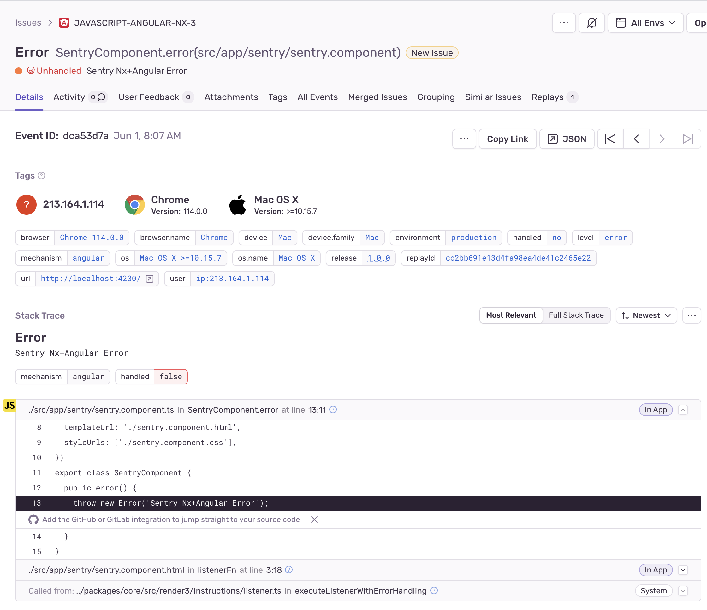

# Set Up Sentry in an `@nx/angular` Project

Follow [this guide](https://github.com/getsentry/sentry-javascript/issues/8267#issuecomment-1571587669) for detailed setup instructions

## Modified files for Sentry setup
* [`src/main.ts`](https://github.com/Lms24/nx-angular-sentry/blob/main/src/main.ts) to init Sentry in the app
* [`src/app/app.config.ts`](https://github.com/Lms24/nx-angular-sentry/blob/main/src/app/app.config.ts) to provide Sentry `ErrorHandler` and `TraceService`
* [`project.json`](https://github.com/Lms24/nx-angular-sentry/blob/main/project.json) to register custom webpack config and enable source maps
* [`webpack.config.js`](https://github.com/Lms24/nx-angular-sentry/blob/main/webpack.config.js) to register and configure the Sentry webpack plugin
* [`src/app/sentry/*`](https://github.com/Lms24/nx-angular-sentry/tree/main/src/app/sentry) a small component that throws a sample error

## Example

The result is a correctly source-mapped Sentry error with an injected release

